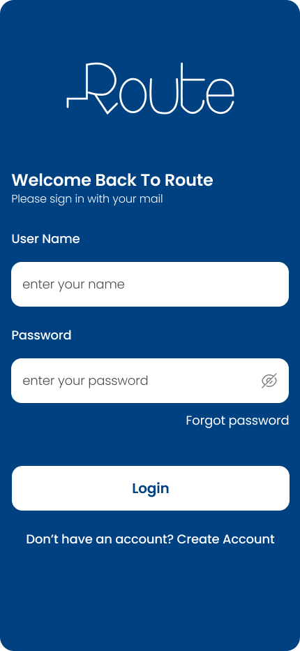
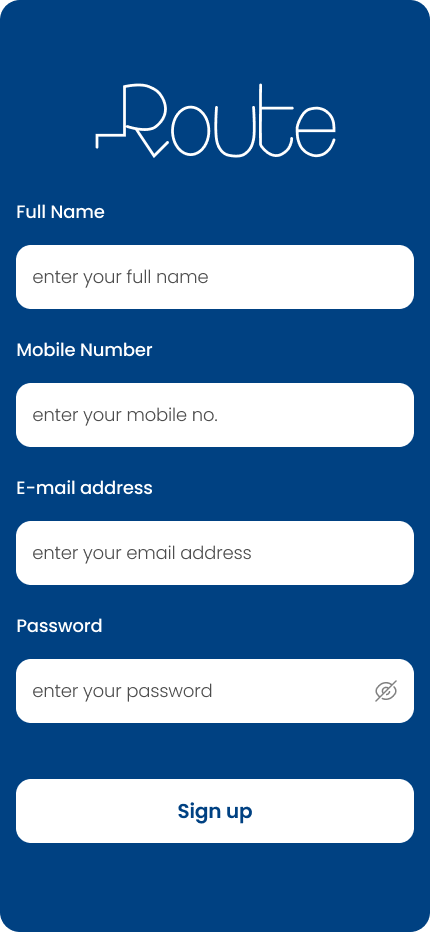
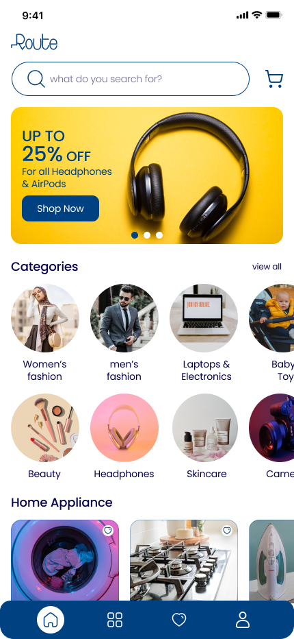
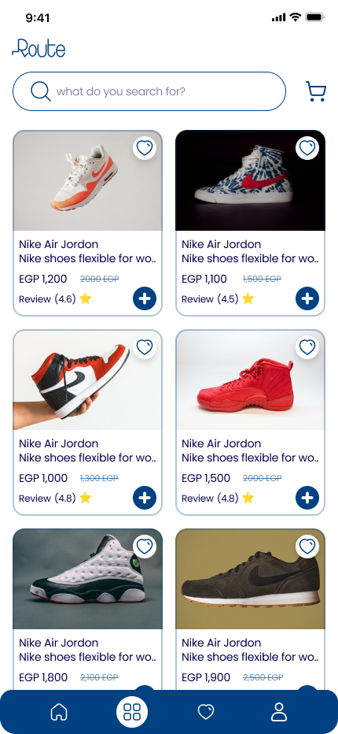
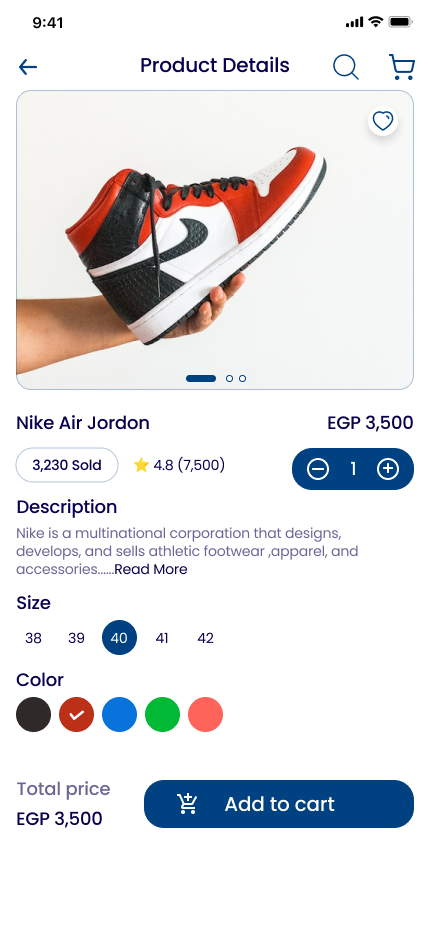
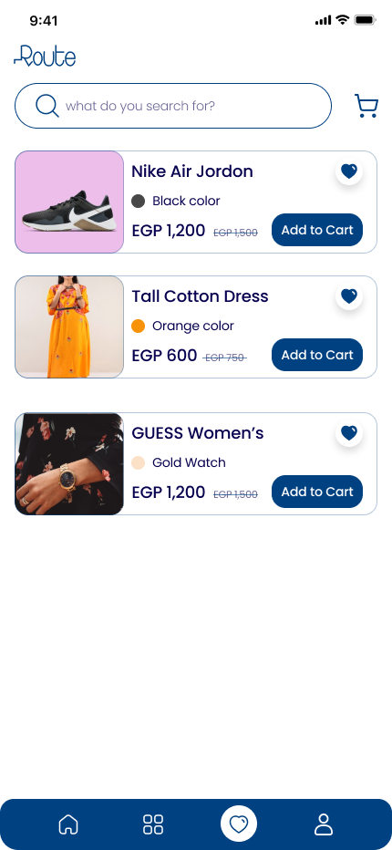
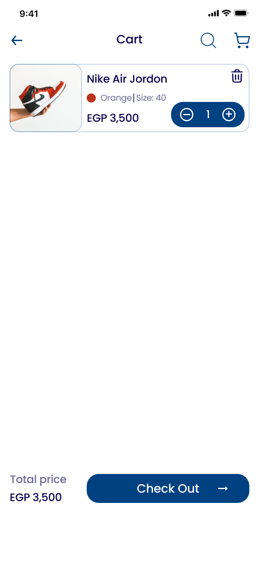

# E-Commerce Project

## 📑 Table of Contents
1. [🚀 Introduction](#-introduction)
2. [🛠 Installation & Setup](#-installation--setup)
3. [🎥 Demo Video](#-demo-video)
4. [🛠 Features](#-features)
5. [📷 Screenshots](#-screenshots)
6. [👥 Contributors](#-contributors)

## 🚀 Introduction
This project is a feature-rich e-commerce platform designed for seamless online shopping experiences. It includes user-friendly navigation, advanced product filtering, secure checkout, and a modern interface.

## 🛠 Installation & Setup
To run this project locally, follow these steps:

### Prerequisites
- Flutter SDK installed ([Get Flutter](https://flutter.dev/docs/get-started/install))
- A code editor (e.g., VSCode or Android Studio)

### Steps
1. Clone the repository:
   ```bash
   git clone https://github.com/Mohammedhussein12/ecommerce.git
   cd ecommerce
2. Install dependencies:
    ```bash
   flutter pub get
4. Run the app:
    ```bash
   flutter run

## 🖥️ Technical Stack

This project utilizes the following technologies and packages to deliver a seamless e-commerce experience:

### **Core Technologies**
- **Flutter**: The primary framework for building the app with a fast, beautiful user interface.
- **Dart**: The programming language used with Flutter.

### **UI & UX**
- **flutter_screenutil**: Ensures the app is responsive across different screen sizes and resolutions.
- **flutter_svg**: Allows easy rendering of SVG images for scalable vector graphics.
- **smooth_page_indicator**: Adds smooth page indicators, providing a polished navigation experience in carousels or onboarding screens.
- **flutter_native_splash**: Customizes the app’s splash screen for a smoother launch experience.

### **State Management**
- **flutter_bloc**: A powerful state management library using the BLoC pattern to manage the app's state efficiently.
- **get_it**: Service locator for managing dependencies across the app.
- **injectable**: Helps automate dependency injection for easier management of services and models.

### **Networking & API**
- **dio**: A robust HTTP client for making network requests with features like interceptors, global configuration, and form data handling.
- **shared_preferences**: Used for local data storage (e.g., saving user preferences, login status).

### **User Interface Enhancements**
- **cached_network_image**: Caches network images for faster load times and reduced data usage.
- **carousel_slider_plus**: Implements responsive and dynamic image/carousel sliders.
- **readmore**: Allows for expandable text in the UI, ideal for product descriptions or long content.

### **Functional Programming**
- **dartz**: Provides functional programming utilities like Option, Either, and Try for better error handling and code clarity.

### **Other Utilities**
- **cupertino_icons**: Provides iOS-style icons for consistency in cross-platform design.
- **colornames**: Makes it easy to use predefined named colors across the app.

### **Development Tools**
- **flutter_lints**: Ensures the code adheres to best practices and style guides.
- **build_runner**: Used for code generation in the project.
- **injectable_generator**: Generates code for automatic dependency injection with `injectable`.


## 🎥 Demo Video
Watch the demo video to see the application in action:
**[Demo Video Link](https://drive.google.com/file/d/1aYZwoT28KJmXuctEhBl1ZB0UJ8TN1fs0/view?usp=drive_link)**

## 🛠 Features

### 🛍️ Shopping Experience
- Browse extensive product catalog with categories
- View product details including images, prices, and reviews
- Choose from multiple color and size options
- Quick "Add to Cart" functionality
- Save favorite items to wishlist
- Real-time price updates and discounts
- Product ratings and reviews system (4.5+ average ratings)

### 🔍 Search & Navigation
- Smart search functionality
- Category-based browsing
- Bottom navigation for quick access:
  - Home
  - Categories
  - Wishlist
  - Profile

### 🛒 Shopping Cart
- Easy add/remove items
- Quantity adjustment
- Size and color selection
- Total price calculation

### 👤 User Account
- Quick signup and login
- Profile management
- Address management

### 💰 Deals & Offers
- Special promotions section
- Up to 25% off on selected categories
- Seasonal discounts
- Featured products section

### 📱 Categories
- Women's Fashion
- Men's Fashion
- Electronics & Laptops
- Baby Toys
- Beauty Products
- Headphones
- Skincare
- Gaming
- Home Appliances

### 💫 UI/UX Features
- Clean, modern interface
- Easy navigation
- Responsive design
- Wishlist functionality
- Shopping cart with counter
- Product image galleries
- Category icons and visuals

## 📷 Screenshots

| Splash | Login | Sign Up |
|------------------------------|------------------------------|----------------------------|
|  |  |  |

| Homepage | Product Page | Product Details |
|-----------------------------|-----------------------------|-----------------------------|
|  |  |  |

| Wishlist | Cart | |
|---------------------------|-----------------------------|-----------------------------|
|  |  | |

## 👥 Contributors
- **Mohammed Hussein** ([Mohammedhussein12](https://github.com/Mohammedhussein12/ecommerce.git))
